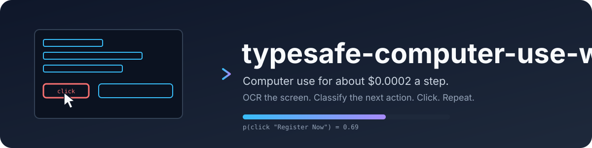

<p align="center">
  
</p>

<p align="center">
  <a href="https://github.com/Vatsa10/typesafe-computer-use-win/actions/workflows/ci.yaml"></a>
  <a href="LICENSE"></a>
  
  
  <a href="https://docs.typesafe.ai"></a>
  <a href="https://github.com/astral-sh/ruff"></a>
</p>

**typesafe-computer-use-win** drives a Windows PC toward a goal you type in plain English, for about a
fiftieth of a cent per step. It never sends a screenshot to a big model. Instead it
reads the screen deterministically, asks a small classifier which action comes next,
and only calls a writing model when a text field genuinely needs free text.

A Windows port of [awlevin/typesafe-computer-use](https://github.com/awlevin/typesafe-computer-use):
same loop and the same decision design, with the platform adapter rewritten over UI
Automation, `user32` and the OCR engine that ships with Windows.

```
winclicker "go to techcrunch and take me to the checkout page for the cheapest tickets to their next upcoming event" --act
```

## Why

Frontier-model computer use is capable and expensive: every step ships a screenshot and
waits several seconds for a plan. Most steps do not need a plan. They need one choice
from a short list, made quickly and cheaply, with a confidence number you can gate on.

[TypeSafe](https://docs.typesafe.ai) sells exactly that: a decision model that answers
a `Choice` over up to 255 options with a full probability distribution and a calibrated
confidence, in a few hundred milliseconds, with free output tokens. This project is a
computer-use loop built around it.

Measured on the same screenshot and goal, one decision each:

| | typesafe (jev) | Claude Opus 5, bare screenshot | multiplier |
|---|---|---|---|
| input tokens | 4,882 | 4,785 | same |
| cost per decision | $0.0002 | $0.032 | 155x cheaper |
| cost per decision, realistic loop with history | $0.0002 | $0.035 to $0.08 | 170x to 390x cheaper |
| cost per 12-step task | $0.003 | $0.40 to $0.90 | 130x to 300x cheaper |
| model latency | 0.13 to 0.38 s | 5.2 s | 14x to 40x faster |
| end-to-end step, with capture and OCR | about 1.5 s | about 5.5 s | 3.7x faster |

The honest caveat: the big model read the event dates off the pixels and compared them
unaided. The classifier needed the date parsing described below. Every piece of
reasoning the frontier model does for free has to be rebuilt here as deterministic state.

## Install

Windows 10 or newer, Python 3.12 or newer, [uv](https://docs.astral.sh/uv/). Everything the
adapter needs ships with Windows: UI Automation for the control tree, `user32` for synthetic
input, and Windows.Media.Ocr for reading the screen. No external OCR binary, no permission
dialog to grant.

```
git clone https://github.com/Vatsa10/typesafe-computer-use-win
cd typesafe-computer-use-win
uv sync
copy .env.example .env   :: fill in the keys
```

| variable | required | purpose |
|---|---|---|
| `TYPESAFE_API_KEY` | yes | every decision |
| `ANTHROPIC_API_KEY` | no | `type_text`, writer-proposed URLs, and the final answer |
| `OPENAI_API_KEY` | no | the same three, from OpenAI; set this and it is the provider |
| `OPENAI_BASE_URL` | no | point the OpenAI path at Groq, OpenRouter or a local server |
| `CLICKER_WRITER_PROVIDER` | no | `anthropic` or `openai`; otherwise whichever key is present wins |
| `CLICKER_EMAIL` | no | enables the `type_email` action |
| `CLICKER_BROWSER` | no | defaults to `Google Chrome` |
| `CLICKER_OCR_LANGUAGE` | no | OCR language pack, defaults to `en-US`; add packs in Settings > Language |
| `CLICKER_OCR_ENGINE` | no | `windows` (default, fast, no per-line confidence) or `rapidocr` (scored, slower) |
| `CLICKER_WRITER_MODEL` | no | defaults to `claude-haiku-4-5` |
| `CLICKER_ANSWER_MODEL` | no | reads the last screen for the final answer; defaults to `claude-sonnet-5` |

Nothing to grant: Windows asks no permission for UI Automation, `SendInput`, or a screen
capture. The one thing to check is elevation. A process running as administrator does not
accept synthetic input from an ordinary one, so a run started from a normal terminal cannot
drive an elevated app; start the terminal as administrator if the target needs it.

## Use

```
uv run winclicker "open the Playground"                 # dry run: one step, prints what it would do
uv run winclicker "open the Playground" --act           # drives the machine, up to 100 steps
uv run winclicker "log in" --act --steps 20 --delay 3   # longer and slower
uv run winclicker-inspect "any goal"                    # 3-2-1, capture, open the annotated screen + payload
```

Clear the terminal first. It is on screen, so its text is OCR input.

**Stopping a live run.** Ctrl-C when the terminal has focus, or slam the mouse into the
top-left corner of the primary display from any app. The loop also stops itself on `done` or
`none`, on confidence under `--min-confidence` (0.4), after two consecutive no-ops, or
at `--steps`.

**The answer.** When the loop stops itself, the writer reads the screen it stopped on
and prints the result: the information the goal asked for, or where things stand and
the next step when the screen does not hold it. A dry run that would have acted, and
an aborted run, print no answer.

## Voice and hotkeys

```
uv sync --extra voice        # whisper.cpp and the microphone bindings, prebuilt
uv run winclicker-daemon     # stays resident and listens for hotkeys
```

| hotkey | does | variable |
|---|---|---|
| `ctrl+alt+space` | hold, speak, release: the line is transcribed locally and classified | `CLICKER_HOTKEY_TALK` |
| `ctrl+alt+g` | type a goal into an overlay instead of speaking it | `CLICKER_HOTKEY_GOAL` |
| `ctrl+alt+p` | pause or resume the running loop | `CLICKER_HOTKEY_PAUSE` |
| `ctrl+alt+x` | abort the run, keeping the run folder | `CLICKER_HOTKEY_ABORT` |
| `ctrl+alt+q` | quit the daemon | `CLICKER_HOTKEY_QUIT` |

**A transcript is not a goal.** "stop", "pause a second" and "never mind" are instructions about
the run, not work to carry out, so every line goes to the classifier first: one `Choice` over
`run_goal`, `stop_run`, `pause_run`, `resume_run`, `quit_daemon` and `ignore`, with whether a run
is active and whether it is paused in the state, plus a `Noul` scoring whether the line was heard
cleanly at all. Below `CLICKER_VOICE_MIN_CONFIDENCE` (0.55) the daemon prints what it heard and
does nothing, because a misheard command clicks a real machine, and there is no undo for a click.

The two gates are not applied alike. Every answer must clear the confidence floor, but only a goal
must also have been heard cleanly. Measured against the live model, short imperatives score low on
any question about whether a line is complete, so gating commands on that number would leave a
running loop impossible to stop by voice, which is the one thing voice must always manage. The
risks are not symmetric either: a misheard "stop" ends a run that can be started again, while a
misheard goal sets a machine clicking at something nobody asked for.

Transcription is whisper.cpp on the CPU (`CLICKER_WHISPER_MODEL`, default `base.en`), so the audio
never leaves the machine and is never written to disk. Measured here: four seconds of speech
transcribes in 0.68 s once the model is loaded, about a fifth of real time, and interpretation adds
0.3 to 0.4 s. The first use downloads the model, which took about 50 s. `pywhispercpp` installs as
a prebuilt wheel on Python 3.13 for Windows AMD64, so the extra needs no compiler. An utterance is
capped at `CLICKER_VOICE_MAX_SECONDS` (30) in case the key is never released.

Proper nouns are the weak spot: "TypeSafe" comes back as "Type Save". The goal still classified at
full confidence, because the classifier reads the intent rather than matching the string, but a
site whose name the model cannot spell is better reached through the catalog.

## The panel

```
uv run winclicker-ui
```

A local control panel, in three tabs. **Run** takes a goal typed or spoken and shows the step feed
as it happens, with Start, Pause and Abort wired to the same control the hotkeys drive.

It opens in **Dry run**, and that is the default on purpose: a goal is captured, perceived and
decided, the choice and its confidence are printed, and nothing is clicked. Switch to **Act** when
you want it to drive. The **voice** switch turns push-to-talk off without stopping the daemon, and
**Test voice** runs the whole voice path once — record, transcribe, classify — then reports what
the line was taken for and whether it would have acted, without queueing anything. That is the
cheap way to find out how your microphone and your phrasing survive the model before letting a run
loose on the machine. **History**
lists the `runs/` folder, and for any step shows the annotated capture that step decided on.
**Settings** edits the hotkeys, the OCR engine, the whisper model and the confidence floors, and
writes them back to `.env` in place, keeping your comments and any key it was not asked to change.
API keys are deliberately absent from it: the panel never displays or writes a secret.

It is Tkinter, which ships with Python, and that is the point rather than a compromise. A browser
dashboard would live in the browser this program drives, so a run would read its own interface
through OCR and could click it. A desktop window has a milder version of the same problem, which
is what **hide this window while a run acts** is for, on by default: the panel iconifies when a run
starts and comes back, with the history refreshed, when it stops.

Tk owns the main thread, so the hotkey pump cannot. `Service` runs the pump, the input worker and
the run worker on threads of their own, and everything they say reaches the panel through a queue
drained on a Tk timer, which is the only safe way to put another thread's words into a widget.

## How a step works

```
screen grab   ─► Windows OCR ─► merge lines into blocks ─► drop lines echoing the goal
UI Automation ─► actionable elements (role, label, frame), pruned to the display,
                 the labelled pressable ones it pruned kept as off-screen controls
                     │
                     └─► one numbered list of items, each carrying its source
                     │
UI Automation ─► focused field (role, label, placeholder, value, frame)
user32 + UIA  ─► foreground app and pid, the browser's address bar
clock         ─► local date and time
dates.py      ─► "dated 2026-10-13 (in 27 days)" on any block containing a date,
                 "near a line dated ..." on its neighbours
                     │
                     ▼
        one TypeSafe request, three Choices, four with off-screen controls
        ┌────────────────────────────────────────────────────────────┐
        │ kind      : click_item | use_browser | type_text | scroll… │
        │ item      : which item (used only for click_item)          │
        │ site      : which website (used only for use_browser)      │
        │ offscreen : which hidden control (only for press_offscreen)│
        └────────────────────────────────────────────────────────────┘
                     │
                     ▼
        deterministic action ─► wait ─► next step
```

Items carry where they came from: `ocr` for a text block, `ax` for a control the app
declared, `ax+ocr` when both found the same thing. An `ax` item reads as
`button 'Share' (top-right)` in the criteria, so the classifier can tell a real control
from a line of text.

Splitting the decision into three questions keeps screen noise out of the action
choice. Every stall found while building this came from two options that meant the
same thing. Confidence measures concentration, so overlapping options always read as
doubt. Keep the action set mutually exclusive.

### OCR cost

OCR is cheap here: Windows.Media.Ocr reads a 2560x1600 screen in about 0.06 s, against
1.5 s of decision latency. The crop and reuse machinery below is inherited from the macOS
original, where Vision cost two thirds of a step; on Windows it is a small win rather than
the point, and it still pays on the biggest screens.

- **Crop.** Each step reads the foreground window with an 8 px margin, plus the strip over
  the same columns at the top of the display, clamped to it. Text on the desktop and in
  background windows is noise to the decision. Clipping the strip to the window's width is
  what makes the crop pay on a maximised window. The cost: the clock and the tray icons to
  the right of the window go unread. They stay clickable through UI Automation.
- **Reuse.** The capture is compared with the previous one at 1/8 scale, in 256 px tiles.
  Unchanged tiles keep the lines they produced last step. The changed tiles are clustered
  into blobs, sides and corners counting as touching, and each blob becomes a rectangle
  read on its own. Scattered change is the ordinary case, a clock digit plus one repaint,
  and one rectangle around both would span the display. Each rectangle grows until no known
  line straddles its edge, because a crop through a line returns the half it can see; ones
  that meet after growing merge, and more than four merge by closest pair down to four.
  Past 60% changed tiles, past 60% of the region in summed rectangle area, or on an app
  switch or a window move, the whole region is read instead.

The timing line says how much was read, and in how many pieces: `ocr 0.31s (22% of screen,
2 rects)`. A replay (`--image`) always reads the whole image and never reuses, so an offline
repro matches the original run.

### UI Automation tree

OCR cannot see an icon. UI Automation can, so each step also walks the foreground process
for labelled, on-screen controls. Coverage is uneven and depends on the toolkit: Chrome
and Edge publish a full tree, WinUI and Win32 apps publish a good one, Electron apps vary,
and a terminal exposes its grid as one text area. So the tree is a bonus source, never a
replacement.

Control types are reported under the AX role names the rest of the code speaks, one dict in
`windows.py`: `ButtonControl` becomes `AXButton`, `EditControl` becomes `AXTextField`,
`ListItemControl` becomes `AXCell`. Labels come from `Name`, or from a short `ValuePattern`
value when a control has no name. A decorative image takes the label of the control around
it; a list row takes it from a shallow static text child.

Frames lie, so the walk prunes hard:

- skip any subtree whose real frame misses the display (Chromium parks scrolled-out nodes
  above the viewport, and a window on a second monitor is off the captured one)
- skip any node under 4 px wide or tall (Chromium clamps scrolled-out web nodes to slivers)
- skip menu subtrees, which are items behind a closed menu with no frame worth clicking
- skip nameless group and pane layout boxes, even pressable ones
- offer a control once per role, label and frame, but keep walking the repeat: UI Automation
  wraps a window in panes of its own size and label, and pruning there loses the whole app
- stop at 4000 nodes or 0.6 s and say so

Walks measured here: Chrome 88 on-screen controls and 37 off-screen in 0.35 s, Notepad 26 in
under 0.1 s. A step against Chrome costs about 0.4 s in the tree and 0.13 s in OCR.

#### Off-screen controls

A pattern invoke does not need an element to be visible. Chromium delivers a press to a link
it clamped to a 1 px sliver because the page is scrolled past it, a collapsed side panel still
exposes its buttons, and an app's tab strip keeps offering the tabs scrolled out of it. So the
same walk keeps the labelled, pressable nodes it pruned, and offers them as a separate capped
list rather than mixing them into the items: nothing on the capture points at them, and a
mouse click would land somewhere else entirely.

The list is deduplicated by role and label, drops any label the visible items already carry,
and stops at 120 controls, after which those subtrees are pruned as before, so the walk costs
what it always did. It is offered only when it is not empty, as a `press_offscreen` action
plus an `offscreen` question, and the step log counts it next to `ax=`. A refusal is the end
of it: there is no pixel to fall back on, so it reads as a no-op. What a walk finds depends
on the app, and the node and time caps bind first on a big tree: a heavy web page spends its
whole node budget on what is already on screen and reports nothing hidden.

### Action space

| key | does |
|---|---|
| `click_item` | invoke the element through UI Automation when the item came from it, so the press lands on the control rather than on whatever covers it; a `SendInput` click at the center of the box otherwise, and as the fallback when the invoke is refused |
| `press_offscreen` | invoke a labelled control the app exposes but does not show, chosen from the off-screen list; offered only when that list is not empty, and a refusal counts as a no-op since there is no pixel to fall back on |
| `use_browser` | go to the browser, showing the website the `site` answer names: `none` brings it forward on the page already open there, a `SITES` catalog key launches the browser on that URL, and `other` opens a URL the writer proposes |
| `type_text` | the writer composes the string; it is set on the focused element through the UI Automation value pattern, with Unicode keystrokes as the fallback when the value does not read back, and a TypeSafe Noul then checks the field's value |
| `type_email` | fills in `$CLICKER_EMAIL` the same way; refused unless a text field is focused |
| `switch_window` | bring a window that is already open to the front, chosen from the window question: any monitor, minimized or not, which is always better than opening a second copy |
| `open_app` | launch an installed application, chosen from the app question; the key indexes the Start Menu catalog, so the path never comes from model text |
| `press_enter`, `press_escape` | keyboard |
| `scroll_down`, `scroll_up` | 10 lines of wheel, after parking the cursor over the foreground window |
| `wait` | screen still loading |
| `done`, `none` | stop |

### What else is running

A capture is one display. The machine is all of them, and this one has three. Before the window
inventory existed, a goal about something on another monitor read as "nothing on this screen
helps" — which, from the loop's side, was true and useless.

Each step now reports every open window: its app, its title, which monitor it is on, whether it is
minimized, and which one is in front. Two actions act on that. `switch_window` brings one forward,
`open_app` launches something that is not running at all, from the Start Menu catalog — 113
shortcuts on this machine, 71 after the junk is dropped.

The display that gets read is the one holding the foreground window, not always the primary. That
also means every click has to be offset by where that display sits on the virtual desktop: the
third monitor here starts at x=5120, so a capture-relative click would otherwise land on the first
screen. `Screen.origin` carries it, and the accessibility walk takes the same offset when deciding
what counts as on screen.

Measured on this machine, with WhatsApp open on monitor 1 while monitor 3 was in front:
`switch_window` at 1.00, and the window question put 0.98 on the real WhatsApp against 0.02 on a
browser window whose title also said WhatsApp. Asked for Excel, which was not running at all:
`open_app` at 0.99 and `excel` at 1.00.

Two filters matter and are there for a reason. A packaged app appears twice, once as itself and
once as the `ApplicationFrameHost` frame around it, and offering both splits the probability
between two answers that do the same thing. And the app catalog drops the accessibility tools —
Narrator, Magnifier, On-Screen Keyboard, Voice Access — because a program that drives the machine
must never launch something else that also seizes the keyboard, focus or screen; the run could not
recover from it.

### Which sites it can reach

The catalog is not a list in the source. It is built from the browser itself: bookmarks, history
aggregated to one entry per origin with visit counts as a prior, the sites the writer has resolved
before, and a pinned core in `config.SITES` that is always offered. On this machine that is 503
sites, built in 0.2 s and cached for a day.

The classifier cannot be handed 503 options. A `Choice` tops out at 255, and long before that the
probability mass spreads thin enough that every answer reads as doubt, which trips the confidence
floor and stalls the run. So a deterministic shortlist runs first — token overlap on label and
domain, weighted by how much of the label the match covers, nudged by the visit prior — and hands
over about 30. It takes 3 to 40 ms and involves no model.

The ranker only needs recall. Asked to "open youtube" against the real profile it offers twelve
sites, including a bookmark whose title merely contains the word; jev then puts 0.99 on `youtube`
and 0.00 on the bookmark. Ranking finds candidates, the classifier discriminates, and code owns
the URL: the model answers with a key, never an address, so a hallucinated URL is not a failure
mode available to it.

A site outside the catalog still resolves through `other`, which asks the writer for a URL — and
that answer is then remembered, so the same site is a plain lookup on every later run. The system
needs the expensive model less the longer you use it.

| variable | does |
|---|---|
| `CLICKER_CATALOG=0` | ignore the browser; offer only the pinned sites, as this worked originally |
| `CLICKER_CATALOG_TITLES=0` | labels become bare domains, so no page title ever leaves the machine |
| `CLICKER_CATALOG_LIMIT` | how many sites the classifier is offered, default 30 |

Titles are cleaned before they are used as labels: email addresses, parenthesised counts, id-like
digit runs and trailing site suffixes are stripped, so `Inbox (9,842) - vatsajoshi2@gmail.com -
Gmail` becomes `Inbox`. Only `Bookmarks` and the `urls` table of `History` are ever read, the
locked history database is copied before reading, and no password, cookie or autofill store is
touched. The shortlist does travel to TypeSafe as part of the state, which is what
`CLICKER_CATALOG_TITLES=0` is there for.

### Where free text comes from

The classifier never generates text. The writer model runs in three places, each with a
small packet and a structured reply:

- **`type_text`** receives the goal, recent actions, the focused field's label and
  placeholder, and the OCR lines near the field. It returns `{fill, text}`. Credential
  fields come back `fill: false` and nothing is typed. After typing, a Noul scores
  whether the field now holds a sensible value. Under 0.5 the field is cleared.
- **`use_browser`** with `site: other` receives the goal and returns `{ok, url}`.
  Code rejects anything that is not a clean https URL with a hostname.
- **The answer**, once, when the loop stops itself. It receives the goal, every action
  taken, why the run stopped, the text of the last screen, and the capture itself,
  because OCR misreads a letter here and there and drops layout. It returns
  `{achieved, answer}`, and is told to take the answer from the screen alone. When an
  action ran after the last capture, the screen is captured again first. This one
  call uses `CLICKER_ANSWER_MODEL`, a stronger reader than the per-step writer.

**Which service writes it** is a key, not a code change. `OPENAI_API_KEY` makes it OpenAI, which
is the default when both keys are present; with only `ANTHROPIC_API_KEY` it is Claude; and
`CLICKER_WRITER_PROVIDER` forces either.
Defaults follow the provider — `claude-haiku-4-5` and `claude-sonnet-5`, or `gpt-4.1-mini` and
`gpt-4.1` — and `CLICKER_WRITER_MODEL` and `CLICKER_ANSWER_MODEL` override either. Both must be
vision models, because the final answer reads the capture.

The OpenAI path speaks the ordinary chat-completions API with a strict JSON schema, so
`OPENAI_BASE_URL` points it at anything that speaks the same shape: Groq, OpenRouter, or a llama
server on this machine. That is the cheap way to keep free text working — Groq's hosted small
models cost a fraction of a frontier model for what is, in this program, three short calls a run.

Measured on this machine against OpenAI: a URL proposed in 2.4 s by `gpt-4.1-mini`, and the final
answer read off a real 2560x1440 capture in 2.9 s by `gpt-4.1`.

Whatever the provider, a failure is a refused step and not a crashed run. An empty balance, a
rejected key, a rate limit or a model the account cannot see all come back as one line in the log
and a step that achieved nothing, which the loop already knows how to carry.

Passwords are never typed. Rely on the browser's password manager or an SSO button
the OCR can read.

## Run folder

Every run writes `runs/<timestamp>/` so a stall can be replayed and fixed offline:

| file | contents |
|---|---|
| `run.log`, `run.json` | everything printed; goal, outcome (`done`, `nothing helps`, `low confidence`, `stalled`, `step limit`, `dry run`, `aborted`, `crashed`), `answer` and `goal_achieved`, seconds, every action, config, and `timing` (mean and max seconds per phase, with `steps_timed`) |
| `answer-raw.png` | the capture the answer was read from, when an action made the last step's capture stale |
| `step-NNN-raw.png` | the capture |
| `step-NNN.png` | items numbered in blue, accessibility ones orange, the chosen one red, the focused field green |
| `step-NNN-payload.txt` | the exact `state` and criteria sent to TypeSafe, then every item with source, role, box, click point, confidence, then the off-screen controls |
| `step-NNN-answers.json` | every probability the classifier returned, the off-screen controls it was offered, plus `timing` for that step |

Each step also logs what it cost, so a slow phase is obvious:

```
  timing: capture 0.31s  screenshot 0.28s  app 0.01s  window 0.02s  field 0.01s  url 0.01s  ocr 0.31s (22% of screen)  ax 0.06s  decide 0.21s  act 0.05s  total 0.95s
```

`capture` covers the four round trips under it; `act` is left out when the step did not act.

Replay a saved capture as if it were live, without touching the screen:

```
uv run winclicker "same goal" --image runs/<ts>/step-003-raw.png --app "chrome" --url "https://example.com/"
```

## Layout

```
typesafe_computer_use_win/
  windows.py      the only module that touches user32, UI Automation, or an OCR
                  engine: synthetic input, app and window control, capture,
                  the focused field, and element actions      (platform adapter)
  axwalk.py       the bounded walk for actionable elements, platform-free
  perception.py   capture, OCR, the read region and the changed-tile cache,
                  block merging, goal-echo filter, the accessibility item
                  source, and the merge of the two
  dates.py        date parsing and "in N days" hints
  decide.py       state, criteria, the three-Choice request, the Noul check
  writer.py       the writer model, structured replies, URL validation, the final answer
  actions.py      one handler per action, each returning a history line
  runner.py       the step loop, run folder, stop rules, the hand-off for the answer
  report.py       logging, annotated screenshots, payload dump
  timing.py       phase stopwatches, the timing line, run summary
  cli.py          `winclicker` and `winclicker-inspect`
tests/            pure logic: dates, merging, reading order, echo filter, config,
                  decisions, the tree walk against a fake tree
```

`windows.py` is the only module that knows it is on Windows. It presses controls through the
Invoke, Toggle, SelectionItem and ExpandCollapse patterns, types Unicode through `SendInput`,
and declares per-monitor DPI awareness at import so window rectangles, cursor positions and
the capture all speak the same physical pixels. A port to another platform replaces that one
file: the walk in `axwalk.py` takes its children, attributes and actions as callables, so only
those three bindings change.

The upstream project targets macOS through Quartz, the accessibility API and Vision OCR. The
loop, the decision design, the OCR cache and the run folder are its work; `windows.py`,
`axwalk.py` and the OCR engine selection are this port's.

## Known limits

- OCR only sees text, and UI Automation only covers apps that publish a tree. In a terminal,
  a canvas, or a game, an icon-only button reaches neither source.
- Two identical labels get only a coarse region hint and split the vote.
- One display is captured per step: the one holding the foreground window. Windows on the others
  are listed, switchable and pressable, but their text is unread until the loop switches to them.
- The default OCR engine reports no per-line confidence, so every line it returns scores 1.0.
  `CLICKER_OCR_ENGINE=rapidocr` scores each line honestly, at about 4 s a screen against 0.06 s;
  install it with `uv sync --extra rapidocr`. Pick one engine per process: initialising both
  WinRT OCR and onnxruntime in the same process crashes the interpreter.
- An elevated app ignores synthetic input from a non-elevated run.
- Using the machine during an `--act` run fights it for focus and the cursor.
- The site catalog is small on purpose; the writer covers the rest.

## Development

```
uv run ruff check . && uv run ruff format --check .
uv run pytest -q
```

CI runs the same on `windows-latest`. See [CONTRIBUTING.md](CONTRIBUTING.md).

## License

[MIT](LICENSE). Copyright the upstream author for the original, and this port's author for
the Windows work; both notices are in the file, as MIT requires.
