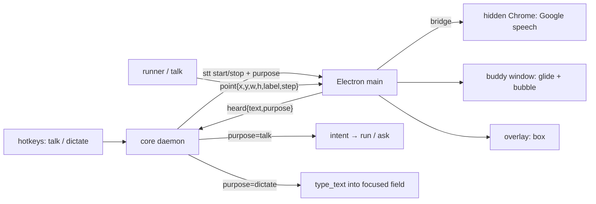

# Cursor buddy, teach mode, dictation — design

**Status:** accepted 2026-10-07
**Goal:** close the gap with heyclicky (`aim.md`): Pointer *shows* where things are, walks you
through the next step out loud, and types what you say.

## Requirements

Functional
- A **cursor buddy**: a small companion that glides from the mouse to a target, with a label
  bubble, on any of the three monitors, never taking focus or clicks.
- **Teach mode**: a spoken screen question is answered step by step; each step names one on-screen
  item, and the buddy points at it while the step is spoken.
- **Act preview**: before every real click the buddy flies to the target, then the click happens.
  Dry runs point the same way.
- **Dictation**: hold a hotkey, speak, release; the words are typed into the focused field.

Non-functional
- Glide ≈ 300–400 ms, 60 fps, honours reduced motion (jump instead of glide).
- Pointing adds at most ~0.4 s to an Act step.
- Coordinates: the core speaks physical virtual-desktop pixels; Electron converts with
  `screenToDipRect` per monitor (150% / 125% / 100% here). Never a global scale factor.
- The buddy window is excluded from what a run reads (same rule as the panel).
- Dictation never routes to the agent: "stop" dictated into a doc is typed, not obeyed.

## Shape

## Decisions

### ADR-1: The buddy is one small Electron window that moves, not a full-screen overlay
- **Context:** three monitors at three scales; transparent windows on Windows must not use
  `WS_EX_LAYERED` without a surface (they paint black).
- **Decision:** one frameless, transparent, `focusable:false`, click-through, always-on-top window
  (~280×120 DIP) whose position is animated by Electron main (`setBounds` per frame, eased).
- **Alternatives:** a full virtual-desktop overlay (one window spanning mixed-DPI monitors renders
  at one scale and blurs or misplaces on the others); per-monitor overlays (three windows to keep in
  sync for one glide across a monitor edge).
- **Trade-off:** crossing a monitor boundary may show one frame of rescale; accepted for simplicity.

### ADR-2: One `point` event for every kind of pointing
- **Decision:** the core emits `point {x, y, w, h, label, tone, step?, of?, hold}` in physical px
  (origin added once). Dry run, Act preview and teach all use it; `highlight` stays for the box.
- **Trade-off:** Act preview waits a fixed glide time instead of an acknowledgement from the UI —
  no round trip, and a missing UI never blocks a click.

### ADR-3: Teach answers name item indexes from the list the core already has
- **Decision:** the answer writer gets the numbered item list and returns
  `{answer, steps:[{text, item}]}`. The core resolves `item` to a box and emits `point` per step,
  speaking each step before the next.
- **Alternatives:** asking the model for pixel coordinates (frontier models are poor at it and it
  costs a screenshot round trip per step).
- **Trade-off:** it can only point at what perception found; an unlisted thing gets text, no arrow.

### ADR-4: Dictation shares the voice path, with a purpose tag
- **Decision:** `stt` events and `heard` carry `purpose: "talk" | "dictate"`. Dictate text goes
  straight to `type_text` on the focused field; it never reaches intent routing.
- **Trade-off:** dictation is one shot per hold (no live streaming into the field).

## Risks

| risk | mitigation |
|---|---|
| Buddy covers the thing it points at | it parks beside the target (offset down-right), the box marks the target itself |
| Act click lands while the buddy is still moving | the core waits the glide time before `click_at`; the buddy is click-through anyway |
| Dictation types into the wrong window | it types into whatever has focus at release, like any dictation; the panel is never focused by it |
| Teach step points at a stale item after the screen changed | one capture per answer; steps are about that capture, said as such |
